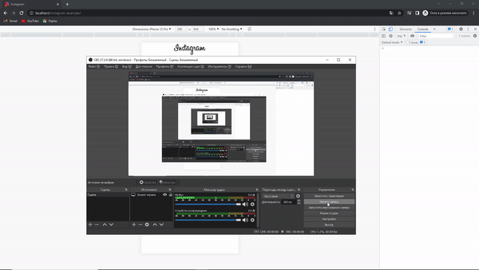

# How to hack anyone while drinking tea at home.

### Legal Disclaimer :

It is illegal to use the guide to attack targets without prior mutual consent.

It is the end user's responsibility to comply with all applicable local, state, and federal laws.

The author assumes no responsibility or liability for any misuse or damage caused by this manual.

## Introduction

Hello, I want to tell you how to easily hack almost any account,   be it Instagram, Facebook, Twitter or even Binance, without much effort or skill. 

I hope this guide is not a call to action, it is meant to help you understand   **how easy it is to get hacked**, and to **keep you from leaking personal information**.

This guide will serve even those people who are far from programming and from IT technologies.

### We will talk about Phishing :

> Mail Phishing

_Mass mailing of letters._

> Spear Phishing 

_Aimed at a specific person or organization._

> Whaling

_Aimed for executive positions, CEO, CFO, etc._

> Smishing

_SMS phishing._

_In this manual, we will use this method._

> Vishing

_Voice phishing, call center._

There are many examples of phishing, we will not list them all, you can read what Phishing is **[here](https://en.wikipedia.org/wiki/Phishing).**

## What you need to know

* HTML
  * We need it to create our fake website. 
  * Very easy to learn.
  * A basic knowledge of this markup language is enough.
  * **[HTML/CSS Course](https://www.freecodecamp.org/learn/responsive-web-design/).**

* CSS
  * Needed for the design of our HTML document.
  * Very easy to learn.
  * **[HTML/CSS Course](https://www.freecodecamp.org/learn/responsive-web-design/).**

* Bootstrap
  * Simplifies and speeds up our page layout process.
  * An open-source framework.
  * Used to create the layout of adaptive web pages.
  * **[Bootstrap Introduction](https://getbootstrap.com/docs/5.1/getting-started/introduction/)**

* PHP (_or any other server-side programming language_)
  * We need it to capture data from a `<form>`.
  * Any server-side programming language will do.
  * My choice was PHP only because I already tested this method.
  * You don't need to know PHP, there are many ready-made solutions on the Internet.

### — Why do we need to know this if you say we can do without knowledge and skills?

> HTML / CSS / Bootstrap :

It will save you money and time.

> Server-side programming language :

You only need to know how to **CTRL+C**, **CTRL+V**.

## Tools we will need

### XAMPP

Needed to run the server on the local computer.

#### Setup and adjustment:

* **[Download from official site](https://www.apachefriends.org/ru/index.html).**

* Just click "Next", you do not need to change anything during the installation.

* The exception may be third-party programs that XAMPP offers to install along with it, in this case, click "Decline", we need only XAMPP.

### NGROK

Needed so that our local computer can be connected to from the outside.

#### Setup and adjustment:

* First of all, you need to **[sign up](https://dashboard.ngrok.com/signup)** to get your personal token.

* Then, you need to **[download ngrok from official site](https://ngrok.com/download)**.

* Copy your token on the main page of ngrok, point 2.

 

* Open the previously downloaded "ngrok.exe" file and paste the copied token into it, then press "Enter", that's it.

## Create our page

### If you have the skills of web-development, create it yourself.

For example, I created a fake Instagram authorization page.

Attentive people will immediately notice that this is a fake page.

I made it literally in 20 minutes, but many people, even those who spend a lot of time on Instagram   may not notice the differences.

> _The goal of the attacker is to create an exact copy of the authorization page_.

> When the design of the page is done, it's time to talk about the main component of our site `<form>`.

#### An example of a `<form>` that we will need :

`<form action="auth.php" method="POST">`

> _The action="" attribute specifies where to send the form-data when a form is submitted._

`<label for="username"></label>`
                
`<input type="text" name="user_name" placeholder="Phone number, username or email">`

> _The attribute <input name=""> must match the value of the variable **$name in the [auth.php](auth.php)** file_
                
`<label for="pwd"></label>`
                
`<input type="password" name="user_password" placeholder="Password">`

> _The attribute <input name=""> must match the value of the variable **$password in the [auth.php](auth.php)** file_
                
`<input id="submit" type="submit" value="Log In">`

> _Submit button_

`</form>`

### Using special software

On the Internet, there are many tools that are designed specifically for phishing,

they do everything for you, you only have to send a link to our victim.

> — So why should we pay a freelancer or create a website by ourselves?

* The benefits of building a website manually :
  * No unnecessary code.
  * Ease of creation.
  * Browser responds normally (_Tested mainly on phones_).
  * Complete control over what happens.

* Software disadvantages :
  * Third-party software may contain malicious code.
  * You need knowledge to use this software.
  * Problems with updates for this kind of software.
  * Detected and blocked by the vast majority of modern browsers.

### If you do not know **[how to create a web-page](https://www.freecodecamp.org/learn/responsive-web-design/)**, I will do it for you for a modest fee.

#### The price for my layout services :

> One adaptive web-page / **💲25**.

> Authorization page / **💲25**.

> Authorization page + Two-factor authentication page / **💲50**.

To order, email me.

My information is in the [contacts](#how-to-hack-anyone-while-drinking-tea-at-home).

## Capturing data from `<form>` by a Telegram bot

### Creating a Telegram bot

* Find a bot with a nickname in Telegram "@BotFather".
* Open the bot window, press `/start`.
* Next we are interested in the `/newbot` command.
* @BotFather will ask for a name for our bot. The name is what will be displayed in the chat list.
* @BotFather asks us to set the username for the bot, username must end with the prefix "bot".

> After we submit our username, @BotFather tells us that the bot was successfully created and gives us a token to access the bot via the HTTP API. 

> We will need it later.

### Creating a Telegram group 

(WE NEED TO CREATE GROUP NOT ~~CHANNEL~~)

* Click "New Group" and name the channel as you like.
* Add the bot we created to your group, the bot is added by its username, for example: `@yourbot`.
* Go to our bot and press `/start`, do not touch it again!
* Now we need to know our chat_id in the group we created, to do that you need to add another bot to the group with a name `@ShowJsonBot`.
* After we have added `@ShowJsonBot`, it should send us a message to the group, we are interested in the line: `"chat": { "id": -111111111}`.
* Copy the id with the “-“ sign we will need it later, you can now remove `@ShowJsonBot` from our group

### Setting up our **[auth.php](auth.php)**

> If you have not changed the attribute `<input name="">` from our **[index.php](index.php)** `<form>`,   leave the variables `$name` and `$password` unchanged.

* $token
  * In the `$token` variable, we need to insert the token that we got when we created the bot from `@BotFather`.
* $chat_id
  * In the variable `$chat_id`, insert the id of the chat that we received in our group from the bot `@ShowJsonBot`.

> There are comments in the **[auth.php](auth.php)** file itself to help you understand the rest of the code we can work with.

## Start our server

### Configuring and running XAMPP :
* To our site can be opened locally, the folder with the site, you need to put on the path :
`C:\xampp\htdocs\your_folder_name`
* Launch XAMPP (as administrator)
* We are only interested in the Apache module, click on "Start" in front of it.

* If Apache is green, then everything is working, you can check this by typing in your browser "127.0.0.1" or "localhost".
* To open the page we created, we must add "/your_folder_name" after "127.0.0.1" or "localhost", for example :

> 127.0.0.1/your_folder_name

> localhost/your_folder_name

### Configuring and running NGROK :

* Open ngrok.exe
* At the command prompt, write the following : `ngrok http 80`
  * If you have done everything correctly, you will see a window with the following contents :

* We are interested in the last item "Forwarding", it is underlined with a red line.
* There will be a link which leads to your local server.
* To make the link redirects us to your fake site, you need to add `/your_folder_name` at the end of the link.
* If you have done everything correctly, the link from ngrok will take you to your local server.
* Remember to add `/your_folder_name` at the end of the link.
* Enter a username and password, you can enter any set of letters and numbers, it does not matter, then press "Log In".
* If the browser redirected us to the "Instagram" page and the username and password came to us in the group, then everything works, congratulations.
* The redirect after authorization, you can change in the file **[auth.php](auth.php)**.

`if ($sendToTelegram) {`

<ins>`header('Location: https://instagram.com);`</ins>

`} else {`

`echo "Error";`

`}`

### Here's what I got :

The message in the bottom right corner of the screen is the intercepted data from the `<form>`, impressive, isn't it?

## Let's go

### The fake page is ready, the server is running, what next? Just send the link to the victim and wait?

Definitely not!

Now we are going to talk to you about something without which all of the above would not work:   **[social engineering](https://en.wikipedia.org/wiki/Social_engineering_(security))**.

Thanks specifically to social engineering, this method is one of the most successful in the field of hacking, if not the most successful.

The fact is that people are easily tricked into doing what the attacker wants.

### Some examples of social engineering :

Imagine a person you know well, whether it's your best friend or one of your parents.

Do you know their favorite music group? 
The store they frequent most often?
Favorite TV series? A comic book? A book?

Why do we need all these things?

> The more we know about a person, the easier it is to hack them, below is an example of what I am talking about.

#### One day I decided to test how good this method is on a member of my family and here is how it was :

* I knew that a member of my family adored the band Metallica.
* I went to the website to see if and when Metallica would be playing in our city.
* I went to a site that allows you to send text messages to your phone.
  
  * An example of such a site: https://sms.sellaite.com/index_smssend.php
  * (_Ideally use a paid sms service, because you can choose the name of the sender, which in turn increases the credibility of the user_)

* Next I sent a message to a member of my family with the following content :
  
  * > Hello %person_name%, you won 2 free tickets to Metallica concert %date_of_concert%, write us on Instagram the delivery address:   our-fake-link-to-instagram.com

* I used a local server and ngrok and since the link to our fake site was very long and untrustworthy,   I used a service to shorten the links, examples of such services:
  * https://bit.ly, https://Tinyurl.com, https://t.co etc.

* Before that, I changed the redirection in the [auth.php](auth.php) file from https://instagram.com to https://instagram.com/concertpage to get rid of suspicions.
* And, miracle, the login and password came to us within 5 minutes of sending the message.
> Of course I told my family member that it was me, not the concert organizer.
