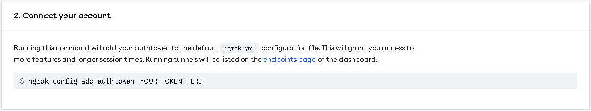
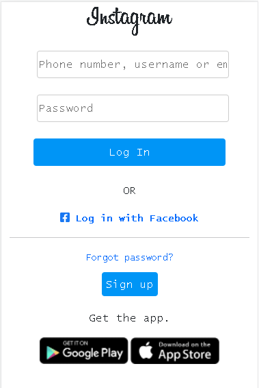

# How to hack anyone while drinking tea at home.
#### Legal Disclaimer :
It is illegal to use the guide to attack targets without prior mutual consent.

It is the end user's responsibility to comply with all applicable local, state, and federal laws.

The author assumes no responsibility or liability for any misuse or damage caused by this manual.
## Introduction
Hello, I want to share with you my observations in the field of information security.

I am far from a professional in this field, I see myself more as a game developer, but nevertheless, I want to tell you how to easily hack almost any account, be it "Instagram", "Facebook", "Twitter" or even "Binance", without much effort or skill.

I hope this guide is not a call to action, it is meant to help you understand how easy it is to get hacked, and to keep you from leaking personal information.

This guide will serve even those people who are far from programming and from IT technologies.

For many people who are even a little bit interested in information security, they are unlikely to learn anything new, nevertheless the simplicity and efficiency of this method is very high and it is impossible to defend against it 100%.

We will talk about ***"Phishing"*** and its ***varieties***.

You can read what ***"Phishing"*** is ***[here](https://en.wikipedia.org/wiki/Phishing).***

## What you need to know

* HTML
  * _We need it to create our fake website, "HTML" is very easy to learn and for our purposes, a basic knowledge of this markup language is enough._
  * ***[HTML/CSS Course](https://www.freecodecamp.org/learn/responsive-web-design/).***
* CSS
  * _Needed for the design of our HTML document._
  * _The course I attached above includes a study of CSS._
* Bootstrap
  * _An open-source framework used to create the layout of adaptive web pages._
  * _Simplifies and speeds up our page layout process._
  * ***[Bootstrap Introduction](https://getbootstrap.com/docs/5.1/getting-started/introduction/)***

* PHP
  * _We need it to capture data from a < form > and then send it to an attacker._

  * _Any server-side programming language will do, be it Javascript, Python, Java, C#, etc._

  * _My choice was PHP only because I already tested this method._
 

> — Why do we need to know this if you say we can do without knowledge and skills?

**HTML/CSS/Bootstrap :**

It will save you money and time, you will not have to look for and pay a freelancer to create you a copy of the page we need.

**As for PHP or any other server-side programming language :**

You only need to know how to "CTRL+C", "CTRL+V", because there are more than enough ready-made solutions on the Internet for our needs.

## Tools we will need
### XAMPP

Is a free and open-source cross-platform web server solution stack package developed by Apache Friends.

Needed to run the server on the local computer.

#### Setup and adjustment:

* ***[Download from official site](https://www.apachefriends.org/ru/index.html).***

* _Just click "Next", you do not need to change anything during the installation._

* _The exception may be third-party programs that XAMPP offers to install along with it, in this case, click "Decline", we need only XAMPP._
### NGROK

Ngrok is a globally distributed reverse proxy fronting your web services running in any cloud or private network, or your machine.

Needed so that our local computer can be connected to from the outside.

#### Setup and adjustment:

* _First of all, you need to ***[sign up](https://dashboard.ngrok.com/signup)*** to get your personal token._

* _Then, you need to ***[download "ngrok" from official site](https://ngrok.com/download)***._

* _Copy your token on the main page of ngrok, point 2._
  *  
* _Open the previously downloaded "ngrok.exe" file and paste the copied token into it, then press "Enter", that's it._
## Create our page
### If you have the skills of web-development, create it yourself.

I will show you an example of how our Instagram page should look like, attentive people will immediately notice that this is a fake page, I made it literally in 20 minutes, but many people, even those who spend a lot of time on Instagram may not notice the differences.

Of course those who are more attentive to details, they will not be impressed by this, so the ***goal of the attacker*** is to ***create an exact copy*** of the authorization page.

#### An example of a `<form>` that we will need :

`<form action="auth.php" method="POST">`

_The action attribute specifies where to send the form-data when a form is submitted._

`<label for="username"></label>`
                
`<input type="text" name="user_name" placeholder="Phone number, username or email">`

_The attribute ***name=""*** must match the value of the variable ***$name in the auth.php*** file_
                
`<label for="pwd"></label>`
                
`<input type="password" name="user_password" placeholder="Password">`

_The attribute ***name=""*** must match the value of the variable ***$password in the auth.php*** file_
                
`<input id="submit" type="submit" value="Log In">`

`</form>`

### If you do not know [how](https://www.freecodecamp.org/learn/responsive-web-design/), a freelancer for a modest fee will do it for you.
